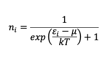
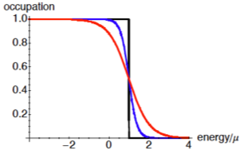
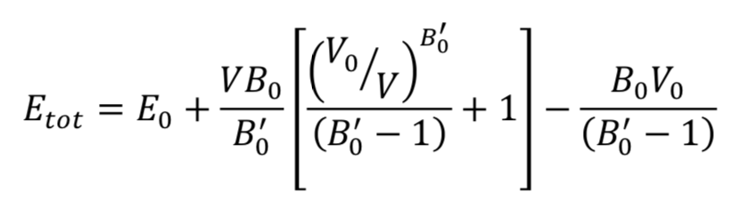

# Project 3:Density Functional Theory and Machine Learning
## MSE 215: Introduction to Computational Materials Science, Fall 2019 
## University of California, Berkeley
### Instructor: Matthew Sherburne
### Graduate Student Instructor: John Dagdelen

## Introduction

In this project, you are going to be using VASP (Vienna Ab Initio Simulation Package, https://www.vasp.at) to study the pressure driven structural transition in Si. At standard temperature and pressure conditions the ground state of Si is the diamond cubic structure. The diamond cubic structure is a face center cubic (FCC) lattice with a two-atom basis. At elevated pressures Si is known to have a structural phase transition to the β-Sn structure at a pressure of 15.2 GPa. Both structures are shown below.

The figure of the diamond cubic structure is actually shown as a body centered tetragonal structure, hopefully helping you see the similarity between the two structures. (It is always possible to represent the FCC & BCC lattices as a body-centered tetragonal lattice.) This representation also allows one to study the transformation pathway between the phases. Another example of a transformation is the Bain transformation caused by strain that takes BCC to FCC in iron. Here it is possible to obtain both the diamond cubic phase and the β-Sn structures of Si merely by changing the ratio of c/a. 

We are going to use VASP to predict the hydrostatic pressure at which Si transforms from the diamond-cubic structure to the β-Sn structure. The procedure is straightforward. You will compute the energy as a function of volume for the two crystal structures and then fit the energy vs. volume curves to an equation of state. You can then determine the transition pressure using standard thermodynamic arguments. 

---

## VASP Background: 

VASP is a very complex program with many sections of code and input files. In this short module on electronic structure methods, which VASP is one of, we will not attempt to understand everything in the code, but focus on key aspects of the code.

- Performs the electronic and ionic minimization and calculates the ground-state properties using Kohn-Sham (KS) orbitals expanded with Planewave (PW) basis set. 
- Solves the KS equations self-consistently with an iterative matrix diagonalization and mixing of charge densities. 
- Calculates the energy terms of the KS Hamiltonian and the charge densities in real and reciprocal spaces via fast Fourier transformations (FFT). 
- Works for any system including atoms, molecules, bulk solids, surfaces, clusters, etc. 
- Provides the pseudopotentials USPP, PAW, etc for most elements. 
- Provides the exchange correlation functionals of LDA, PBE, hybrids, etc. 

### Input files: 
In this repository you will find the files that are required to run VASP: INCAR, KPOINTS, POSCAR and POTCAR. 

#### INCAR: 
This is the central file that controls the run with flags, which allow you to control many aspects of a run. Most of the flags will be left in their default setting. [more info](https://cms.mpi.univie.ac.at/vasp/vasp/INCAR_File.html)

#### KPOINTS: 
This allows you to control the sampling of the Irreducible Brillouin Zone. The simplest way to think about this is to compare this to integrating and the more points you use to integrate over the more accurate (generally) your answer is. [more info](https://cms.mpi.univie.ac.at/wiki/index.php/KPOINTS)

#### POSCAR: 
This contains the structural information for the system, the lattice and the position of the atoms. [more info](https://cms.mpi.univie.ac.at/vasp/guide/node59.html)

#### POTCAR: 
This contains the information about the potential and exchange correlation functions. [more info](https://cms.mpi.univie.ac.at/vasp/vasp/POTCAR_file.html)

For more information on VASP please see the [VASP Manual.](http://cms.mpi.univie.ac.at/vasp/vasp/vasp.html)

### Note:
In the interest of time and computing resources, we have provided a "fake" VASP interface to run you calculations for this project. We have pre-computed all of the data you will need and included it in this repository. The "fake" VASP interface will behave just like VASP actually would, except faster. If you choose not to follow along with the jupyter python notebooks, you can download these directories and simply analyze the output files without any penalty.

---

## Problem 1: Determine the Ground State Structures for the Two Phases 

### Effect of $E_{cut}$ on convergence

First, you will perform density functional theory (DFT) structure relaxation calculations for the diamond cubic phase and determine how sensitive the outcome of these calculations is to the cutoff energy, $E_{cut}$. To determine the an appropriate value of $E_{cut}$ for convergence, you will perform structure optimization calculations at 150, 200, 250, 300, and 350 eV. For all of these calculations, use a 6x6x6 grid of k-points generated via the Monkhorst-Pack scheme. 

### Effect of k-point density on convergence

After you have determined an appropriate $E_{cut}$, you will evaluate convergence with k-point density. Using the value of $E_{cut}$ you found, perform structure optimization calculations for Monkhorst-Pack k-points grids from 2x2x2 to 12x12x12 until convergence is obtained.

You will similarly need to perform the same convergence tests for the β-Sn structure (more information on details in Problem 2.)

---

## Problem 2: Determine the Phase Transformation Pressure

To determine the pressure at which Si undergoes a β-Sn $\rightarrow$ diamond cubic phase transformation, you will calculate the energy of the two structures as a function of volume per atom using the input parameters you determine in part 1. 

Calculating this curve for diamond cubic Si is straightforward - there is only one length scale in the diamond cubic structure, and this is set by the lattice parameter. Simply change the lattice parameter in the POSCAR file. This is slightly more difficult for the β-Sn structure because it is determined by two parameters, not just one. The parameters are a, the lattice parameter, and the ratio, c/a. In principle, at each volume, one needs to vary and c/a to put the crystal under a hydrostatic stress state, while maintaining the volume per atom, a2c/4, constant. This, however, increases the complexity of your task immensely. We will, therefore assume that the ratio c/a does not vary as the volume is changed. This makes computing the energy vs. volume curve straightforward.

Use the same energy cut-off that you found for the diamond cubic structure, but you should check the k-point convergence, which will be slower here since c/a<1.

To find c/a for the β-Sn phase, you will need to relax the atomic structure. This can be accomplished using the INCAR flag ISIF = 3. As you learned in lecture, there are a number of flags that can be set to control the run. One is smearing to set the occupation of the electrons. When converging the electronic structure, one computes the energies at a number of k-points, sorts these energies from lowest to highest, and then occupies the lowest energy states. During the course of a structural relaxation, the specific states that get occupied can change (at each k-point there are a number of band states – these frequently have different symmetries and move up and down in energy at different rates as the potential changes during the numerical search for self-consistency). This change typically yields an abrupt jump in the total energy, and can lead to problems in the numerical approach to finding the self-consistent solution.

To address this problem, one can employ a physically motivated numerical trick. Instead of making the occupations of the energy levels near the Fermi level strictly 0 or 1, one allows partial occupation of the states. The single particle energy levels in nature is governed by the Fermi-Dirac distribution:

Here, $n_i$, is the occupation of the ith energy level $ε_i$ , T is the temperature, k is Boltzmann’s constant, and $μ_i$ is the chemical potential of the particles (this corresponds to the Fermi level T=0). As the temperature is increased, the occupations of the levels near the Fermi level become non-integral. Some of the levels above and below the Fermi level are partially occupied. In electronic structure parlance, this is referred to as occupation smearing.

The benefits of this partial occupation to the numerical approach are obvious. Since the levels near the Fermi level are only partially occupied, the crossing of these levels induced by changes in the potential results in smoother changes in the total energy, and well-behaved numerical routines. Of course, the temperatures at which this smearing is significant are very high. Typically Fermi levels are measured using eV. One eV corresponds to a temperature of approximately 11,000 K. So the smearing in the figure is exaggerated compared to what one expects. 

Modern electronic structure codes smear the occupations at the Fermi level. Since the magnitude of the smearing one employs is quite large, it is a bit unphysical. Consequently, there is no reason a priori to employ the Fermi-Dirac distribution, and other smearing methods, with optimized numerical behavior, have been developed. This development includes smearing the states while understanding how results can be corrected for the unphysical smearing. In our calculation, we will use Guassian smearing with 0.02 Ry (which is large) as our smearing factor. You should check the sensitivity of your answers to choice of smearing. 

As a consequence of the smearing, we need to consider more than just the bands that we know to be filled in the diamond cubic structure. Hence we increase the number of bands that are computed using NBANDS in the INCAR (NBANDS = 8). This tells the code to use 8 bands for the calculation. Since each unit cell has two atoms, and each atom contributes four electrons, only four bands will be filled (assuming the β-Sn structure is not a band-overlap metal). Nevertheless, we increase the number of bands in order to be consistent with the smearing – we cannot smear the filling of non-existent states.

Once you have computed the two energy vs. volume curves, the rest of the problem is straightforward. You will need to fit the results to the Murnaghan equation of state:

Where $V$ is the volume, $V_0$ is the volume at equilibrium, $E_0$ is the energy at equilibrium, $B_0$ is the bulk modulus, and $B'_0$ is the first order coefficient describing the pressure dependence of the bulk modulus. All of the parameters, excepting $V$, should be viewed as fitting parameters. Based on your fitted curves (and the resulting parameters) you should be able to determine the lattice parameters and bulk moduli for the equilibrium structures, as well as the transition pressure and volumes for both phases. 

---

## Problem 3: Train a Machine Learning Model to Predict Bulk Modulus

Machine learning is an emerging tool in computational materials science that can aid in materials discovery and design. In the final part of this project, you will train two statistical models to predict bulk modulus from basic features of a material's structure. Once you have trained this model, you will predict the bulk modulus for the two Si phases you investigated earlier in the project and compare how your ML model stacks up against DFT. 

(More details on this part of the project will be released after Spring Break)

---

## The Report
You should submit a complete, well-written report of how you conducted the calculations and why you did what you did. I would like for this report to contain the answers that you found, as well as a discussion of their values. Do you trust them? How well do they compare with experiment? Etc. You should include relevant sections of output files, input files and any scripts that you used to run the calculations. You are to produce your own results and analysis. This assignment is due on Friday XXXXXXX and submitted through bCourses.

---

## Problem Walkthroughs
The notebooks in this repository will walk you through typical workflows that computational materials researchers today would use to solve these problems today. A lot of the details of running DFT calculations have been abstracted away by software in recent years, which has helped make DFT more accessible, faster to use, and robust. We will be using these tools in this project to give you a taste (and some practical training) on how DFT is done today. 

However, these abstraction layers can hide some important aspects of DFT that you should be aware of. With this in mind, we will also be asking you to prepare some input files by hand so you have a chance to see these details up close. 

Feel free to complete this lab however you would like, but we highly recommend following the jupyter notebooks in this repo and using python to perform the analyses.

## Project 2 Grading: 

Format (this is a professional report)			10pts
Explain Calculation/Introduction			10pts
Output/Input files					10pts

Calculations (and explanation): 
	DC: (Just showing plots is not sufficient)
	Energy convergence				5pts
	Kpts convergence				5pts
	Energy volume curve				10pts
	Explain 					5pts

	Beta-Sn:
	Energy convergence				5pts
	Kpts convergence				5pts
	Energy volume curve				10pts
	Explain					5pts

What is the pressure for transformation		5pts
Compare to experimental value			5pts
Explanation						10pts 
