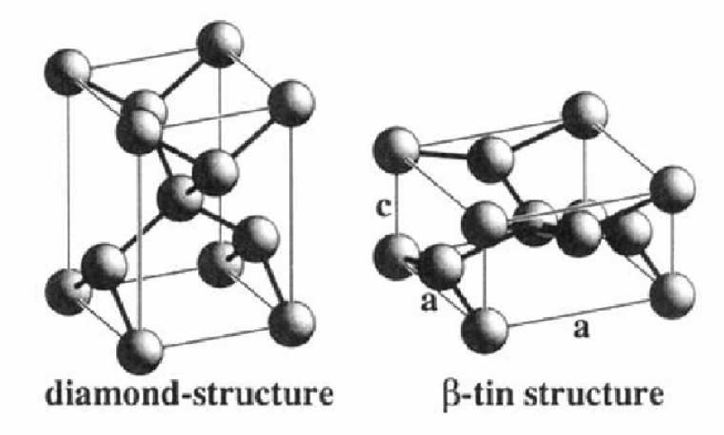

# Project 3:Density Functional Theory and Machine Learning
## MSE 215: Introduction to Computational Materials Science, Fall 2019 
## University of California, Berkeley
### Instructor: Matthew Sherburne
### Graduate Student Instructor: John Dagdelen

Run this repo in an online Binder by clicking the button below: 

[](https://mybinder.org/v2/gh/mse215/project3.git/master)

<h> <span style="color:red"><b>NOTICE TO BINDER USERS: YOUR NOTEBOOK PROGRESS WILL NOT BE SAVED IF YOU CLOSE THIS WINDOW OR LEAVE IT INACTIVE FOR TOO LONG.</b></span> </h>
      
<h> <span style="color:red"><b>PLEASE DOWNLOAD YOUR NOTEBOOKS AND FILES REGULARLY OR DOWNLOAD THIS REPO AND RUN OFFLINE ON YOUR MACHINE. See [how to run offline](running_offline.md) for more info.</b> </span></h>



## Problem Walkthroughs
The notebooks in this repository will walk you through typical workflows that computational materials researchers today would use to solve these problems today. A lot of the details of running DFT calculations have been abstracted away by software in recent years, which has helped make DFT more accessible, faster to use, and robust. We will be using these tools in this project to give you a taste (and some practical training) on how DFT is done today. 

However, these abstraction layers can hide some important aspects of DFT that you should be aware of. With this in mind, we will also be asking you to prepare some input files by hand so you have a chance to see these details up close. 

Feel free to complete this lab however you would like, but we highly recommend following the jupyter notebooks in this repo and using python to perform the analyses.


## Table of Contents

Project Description | 
[MSE 215 Project 3](https://github.com/mse215/project3/blob/master/MSE%20215%20Project%203%20(Spring%202019).ipynb)

#### Problem 1 (Due Tuesday, 04/02/2019):
* Walkthrough Notebook | [01 - Problem 1](https://github.com/mse215/project3/blob/master/01%20-%20Problem%201.ipynb)

#### Problem 2 (Due Friday, 04/12/2019):
* Walkthrough Notebook | [02 - Problem 2](https://github.com/mse215/project3/blob/master/02%20-%20Problem%202.ipynb)

#### Problem 3 (Due Friday, 04/12/2019):
* See description in [MSE 215 Project 3](https://github.com/mse215/project3/blob/master/MSE%20215%20Project%203%20(Spring%202019).ipynb)

#### Problem 4 (Due Friday, 04/12/2019):
* Walkthrough Notebook | Coming Soon!

## Project 2 Grading: 
```
Format (this is a professional report)		10pts
Explain Calculations/Introduction		10pts
Output/Input files				10pts

DFT Calculations (and explanation): 
(Just showing plots is not sufficient)
	
	Diamond Cubic: 
	Energy convergence			5pts
	Kpts convergence			5pts
	Energy volume curve			10pts

	Beta-Sn:
	Energy convergence			5pts
	Kpts convergence			5pts
	Energy volume curve			10pts
	
What is the pressure for transformation		5pts
Compare to experimental value			5pts
Explanation					10pts
Thourough analysis of excerpt from literature	10pts

Bulk Modulus ML:
	Report features used			5pts
	Report cross validation scores		5pts
	Plot learning curves			10pts
	Bulk modulus within 20% of DFT		5pts
	Report final score on test set		5pts
	Test set RMSE < 20 GPa			10pts
```
